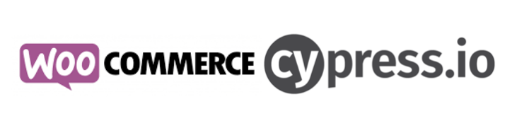

# gap-qa-automation-bootcamp

## General Information

This automation toolkit package is intended to cover testing for a dummy shopping site which comes already filled with sample products and realistic user workflows.

- http://ec2-100-25-33-224.compute-1.amazonaws.com:8000/

The following actions are performed:

- Setup:
    - Create a new coupon.
    - Create and order using a product and the recent created coupon.
- Integration Tests:
    - Verify that a specific product can be requested (API Test).
    - Verify that a specific coupon can be requested (API Test).
    - Verify that the order shows the proper discount value (UI Test).

## API Documentation:

- https://woocommerce.github.io/woocommerce-rest-api-docs/

## User Guide

**Installation Requirements**

Git
Cypress
Nodejs
Npm
a source code editor

**Steps to run the test**

1. git clone https://github.com/euribes/gap-qa-automation-bootcamp.git
2. cd into the project folder and install dependencies with command npm install
3. Open cypress with following command: npx cypress open 

